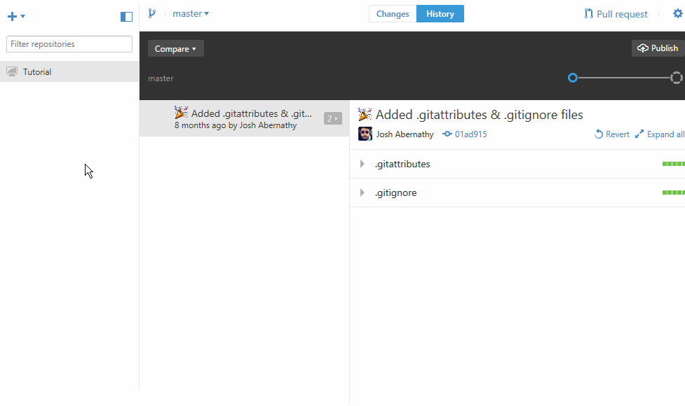
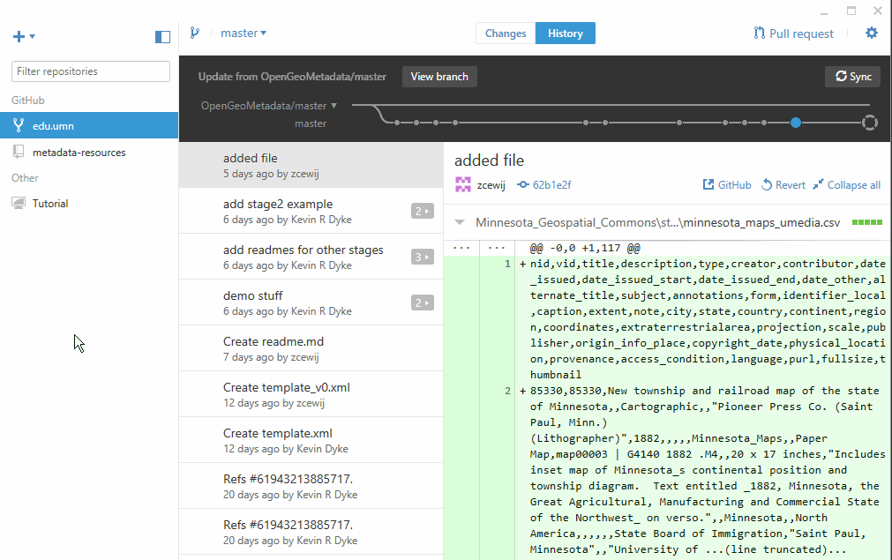
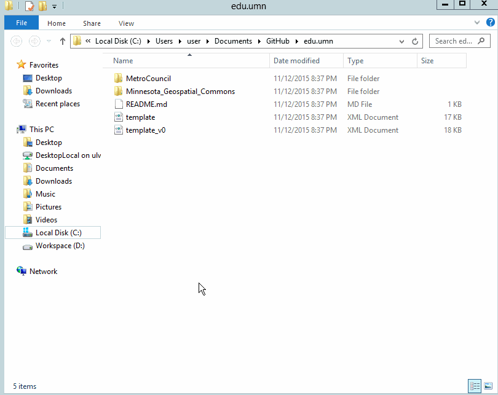
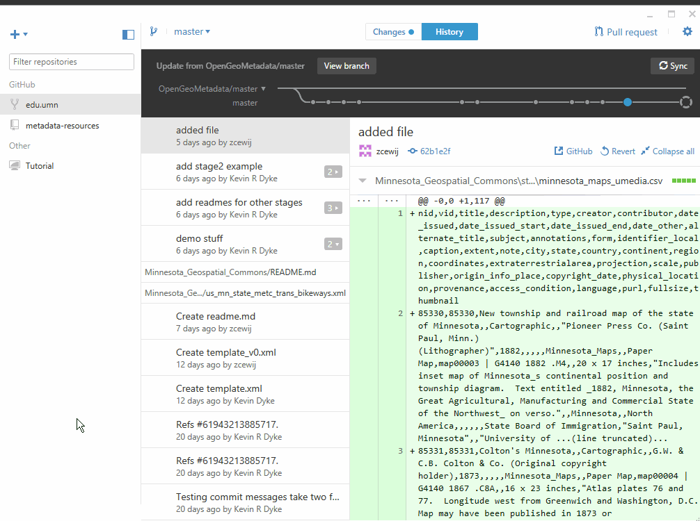
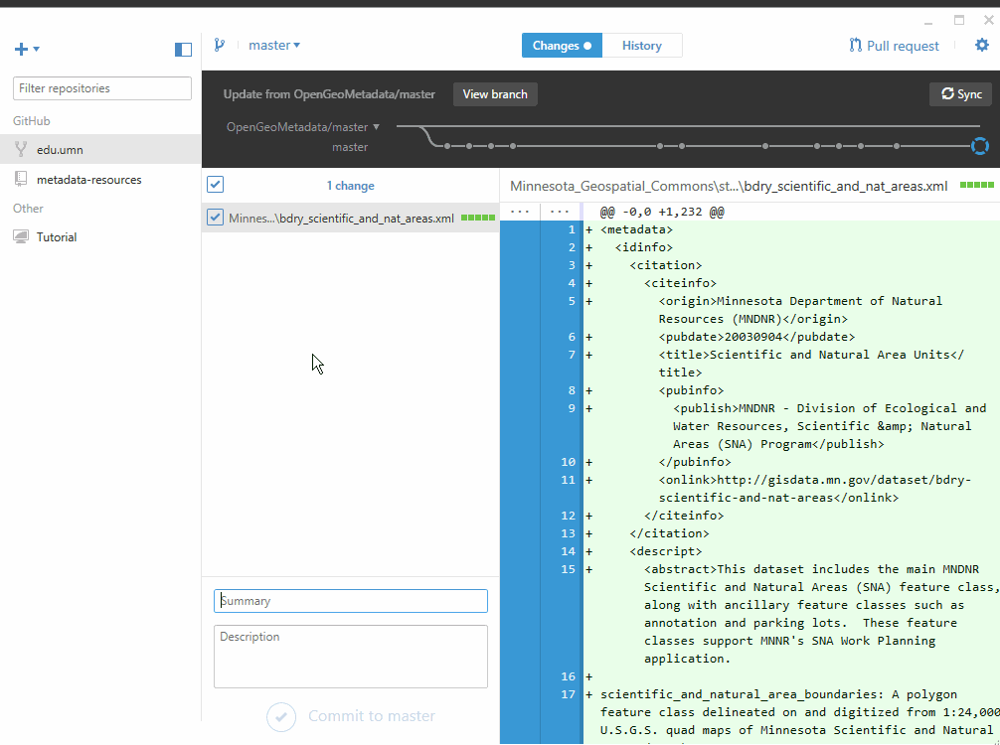
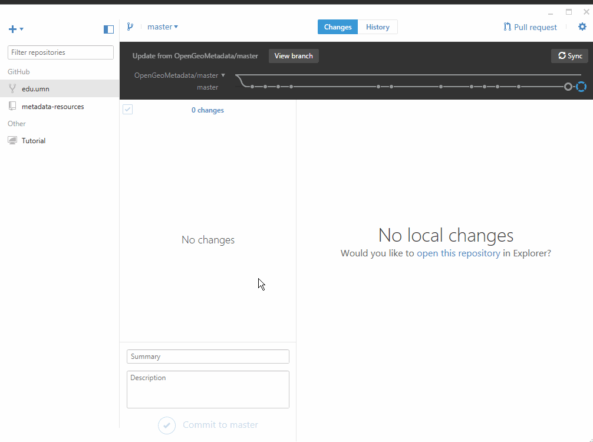

1. Download and install the GitHub Desktop application from [desktop.github.com](https://desktop.github.com/)

2. Once installed, sign in using your GitHub username and password (which we set up during the Summit)  

3. Now, clone your institution's repository, as shown below.  
  
      
  
4. To take a look at how the repository looks on your computer, right click its name and select "Open in Explorer" (or "Open in Finder" for Mac).  
  
	  
  
5. Next, to add metadata files to Stage 1 of a collection, double click the folder with the name of the collection you're working on, then double click on the `stage1` folder.  *Note: we are now using the more descriptive name "1_submit_records" for this folder-KM*
  
	  
  
6. Depending on your own desired workflow, you can then cut and paste metadata XML files from elsewhere on your computer into this folder. Or, you could download them from the Internet directly into the `stage1` folder.  
  
	  
	*Note that you can add as many file as you'd like at this point, not just one at a time.*  
  
7. Once you've added as many files as you feel like adding at the moment, you can "push" them online for your colleagues and the rest of the task force to see. To do so, return to to the GitHub application and click on "Changes" (or "<some number> uncommitted changes" on Mac). You should see each file you added.  
  
	  
  
8. Now, add a brief summary of what you added (you don't need a bunch of detail), then click on the checkmark below.  
  
	  
  
9. Finally, to move the files online, click the "Sync" button in the upper right portion of the application.  
  
	  
